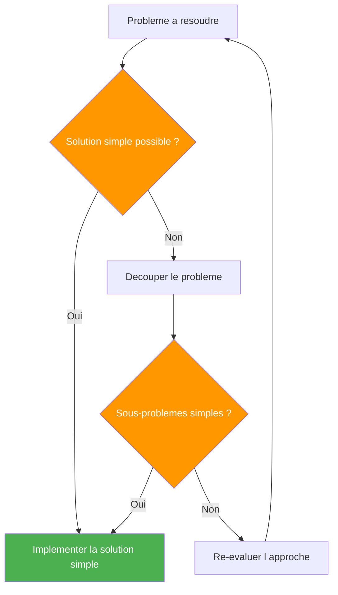
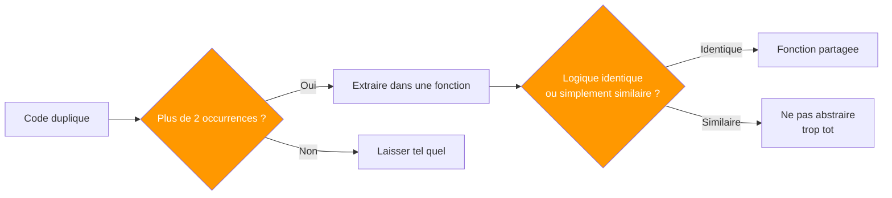
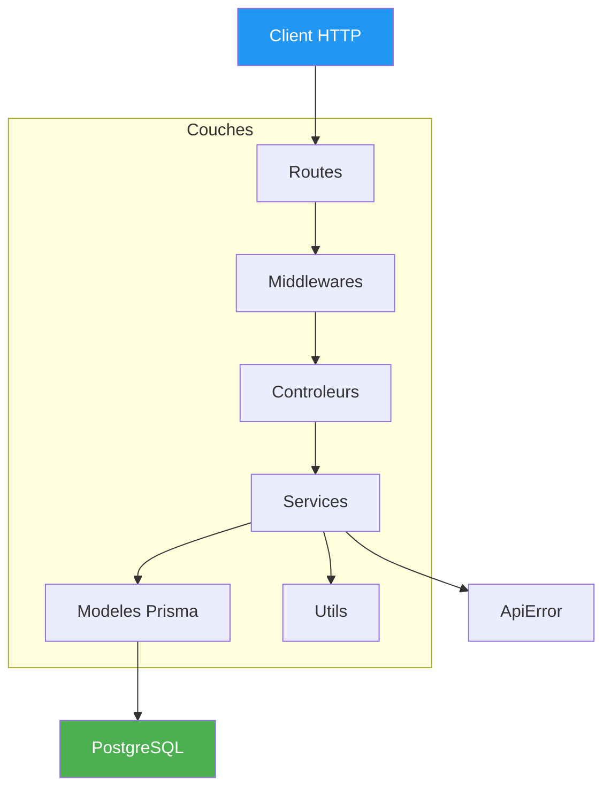
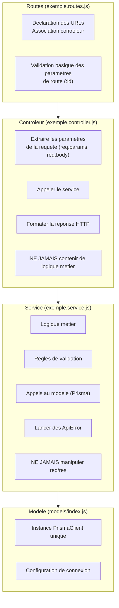
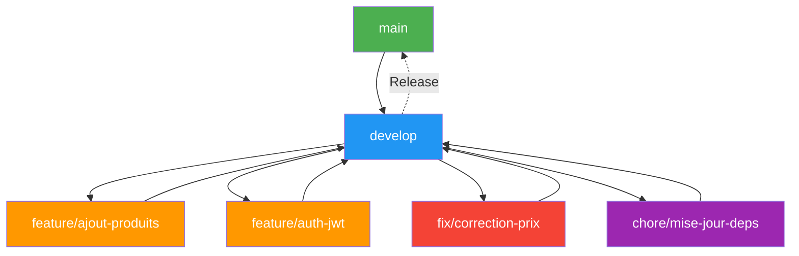
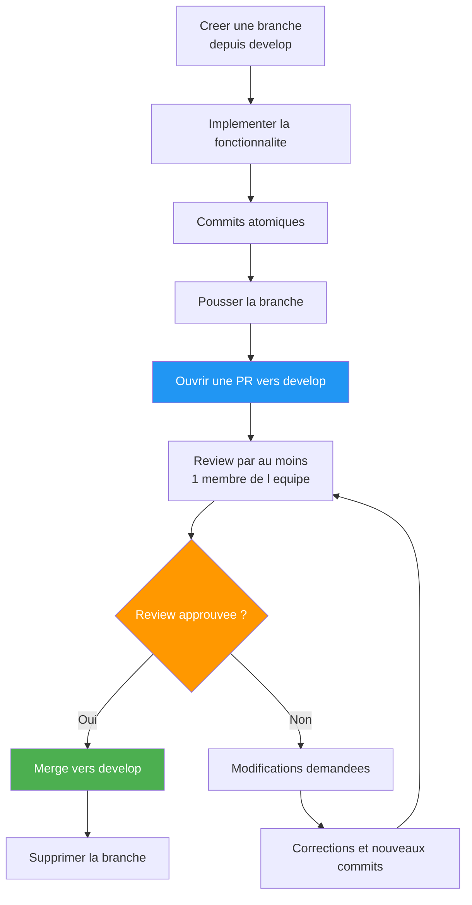
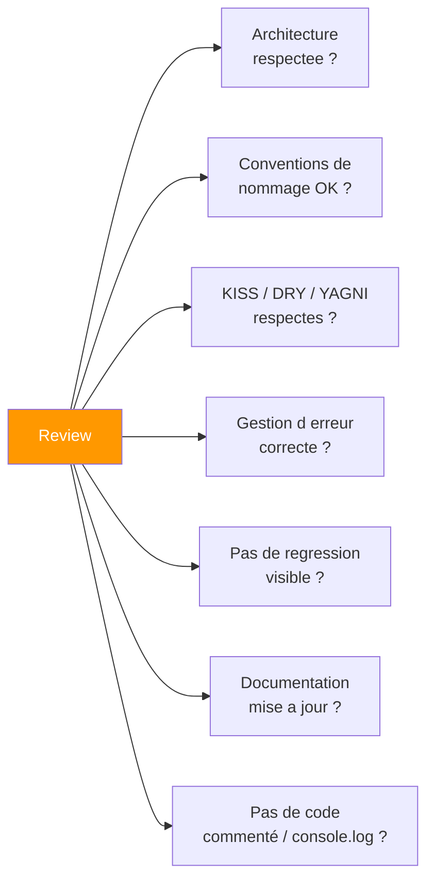
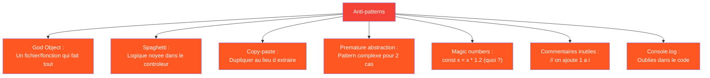

# Guide de contribution — OmniaCom Backend

Ce document definit les standards de code, les regles d'architecture, les conventions de nommage, et le workflow Git a respecter sur ce projet. Toute contribution doit s'y conformer.

---

## Table des matieres

1. [Principes fondamentaux](#1-principes-fondamentaux)
2. [Architecture du projet](#2-architecture-du-projet)
3. [Conventions de nommage](#3-conventions-de-nommage)
4. [Regles d ecriture du code](#4-regles-d-ecriture-du-code)
5. [Gestion des erreurs](#5-gestion-des-erreurs)
6. [Workflow Git](#6-workflow-git)
7. [Conventions de commits](#7-conventions-de-commits)
8. [Pull Requests](#8-pull-requests)
9. [Code Review](#9-code-review)
10. [Documentation](#10-documentation)
11. [Cas pratiques](#11-cas-pratiques)

---

## 1. Principes fondamentaux

### 1.1 KISS (Keep It Simple, Stupid)

La simplicite est la priorite absolue. Une solution simple est plus facile a comprendre, tester, deboguer et maintenir.



**Regles KISS :**
- N ajoutez jamais une abstraction « au cas ou ». Attendez d avoir 3 repetitions avant d abstraire.
- Une fonction = une responsabilite. Si elle fait deux choses, decoupez-la.
- Une fonction ne doit pas depasser 40 lignes. Si c est le cas, extrayez des sous-fonctions.
- Un fichier ne doit pas depasser 300 lignes. Au-dela, decoupez-le.
- Evitez les design patterns inutiles. Un simple `if` vaut mieux qu un `StrategyFactory` pour 2 cas.

### 1.2 DRY (Don t Repeat Yourself)

Ne dupliquez pas la logique. Mutualisez ce qui est identique, mais ne forcez pas la mutualisation de ce qui est simplement similaire.



**Piege du DRY-force :** Deux fonctions qui se ressemblent a 70% ne doivent pas forcement etre fusionnees avec 3 parametres et 4 conditions. Parfois la duplication est moins chere que la complexite d une abstraction prematuree.

### 1.3 YAGNI (You Ain t Gonna Need It)

N implementez jamais une fonctionnalite « au cas ou ». Implementez uniquement ce qui est necessaire maintenant.

### 1.4 Separation des responsabilites

Chaque couche a un role unique et ne doit pas empieter sur une autre.

---

## 2. Architecture du projet

### 2.1 Vue d ensemble



### 2.2 Responsabilites de chaque couche



### 2.3 Regles strictes par couche

#### Routes
- Contiennent UNIQUEMENT la definition des chemins et le binding controleur.
- Ne doivent pas contenir de logique (pas de `if`, pas de traitement, pas d appel DB).
- Un fichier de routes par ressource (ex: `utilisateur.routes.js`, `produit.routes.js`).
- Les routes sont enregistrees dans `routes/index.js` avec leur prefixe.

```javascript
// BON - La route ne fait que lier URL et controleur
router.get("/:id", controller.getById);

// MAUVAIS - Logique dans la route
router.get("/:id", (req, res) => {
  // Ne JAMAIS faire ca
  const data = await prisma.findMany();
  res.json(data);
});
```

#### Controleurs
- Extraient les donnees de la requete (`req.params`, `req.body`, `req.query`).
- Appellent le service correspondant.
- Formatent la reponse JSON.
- Attrapent les erreurs avec `try/catch` et les passent a `next()`.
- NE DOIVENT PAS contenir de logique metier, de calculs, d appels DB directs.

```javascript
// BON - Le controleur ne fait que transmettre
export async function getById(req, res, next) {
  try {
    const id = parseInt(req.params.id, 10);
    const item = await service.findById(id);
    res.json({ success: true, data: item });
  } catch (err) {
    next(err);
  }
}

// MAUVAIS - Logique metier dans le controleur
export async function getById(req, res, next) {
  try {
    const id = parseInt(req.params.id, 10);
    // NE PAS faire de validation ici
    if (!Number.isInteger(id)) {
      return res.status(400).json({ error: "ID invalide" });
    }
    // NE PAS appeler Prisma ici
    const user = await prisma.utilisateur.findUnique({ where: { id } });
    if (!user) {
      return res.status(404).json({ error: "Introuvable" });
    }
    // NE PAS faire de transformation ici
    const data = { nomComplet: `${user.nom} (${user.email})` };
    res.json({ success: true, data });
  } catch (err) {
    next(err);
  }
}
```

#### Services
- Contiennent la logique metier et les regles de validation.
- Appellent le modele Prisma.
- Lancant des `ApiError` avec des codes HTTP appropries.
- NE DOIVENT PAS connaitre `req`, `res`, `next`.
- Peuvent appeler d autres services.

```javascript
// BON
export async function findById(id) {
  const utilisateur = await prisma.utilisateur.findUnique({ where: { id } });
  if (!utilisateur) {
    throw new ApiError(404, "Utilisateur introuvable");
  }
  return utilisateur;
}

// BON - Service appelant un autre service
export async function inscrireUtilisateur(email, nom) {
  const existant = await prisma.utilisateur.findUnique({ where: { email } });
  if (existant) {
    throw new ApiError(409, "Cet email est deja utilise");
  }
  // Appel a un autre service (ex: envoi d email)
  await emailService.envoyerEmailBienvenue(email, nom);
  return prisma.utilisateur.create({ data: { email, nom } });
}
```

#### Modeles
- Point d acces unique a Prisma.
- Ne contiennent que l initialisation du client Prisma.
- Ne jamais creer plusieurs instances de `PrismaClient`.

---

## 3. Conventions de nommage

### 3.1 Regles generales

| Element | Convention | Exemple |
|---|---|---|
| Variables | `camelCase` | `const nomUtilisateur = "Jean"` |
| Fonctions | `camelCase`, verbes | `async function getUtilisateur()` |
| Classes | `PascalCase` | `class ApiError` |
| Fichiers JS | `kebab-case.js` | `exemple.service.js`, `errorHandler.js` |
| Dossiers | `kebab-case` | `src/middlewares/`, `src/utils/` |
| Constantes | `UPPER_SNAKE_CASE` | `const MAX_RETRIES = 3` |
| Variables d env | `UPPER_SNAKE_CASE` | `DATABASE_URL`, `NODE_ENV` |
| Exports nommes | `camelCase` | `export async function findAll` |
| Export default | `camelCase` | `export default router` |
| Modeles Prisma | `PascalCase` (singulier) | `model Utilisateur` |
| Tables Prisma | `snake_case` (pluriel) | `@@map("utilisateurs")` |

### 3.2 Noms de fichiers

Structure stricte : `{nom}.{couche}.js`

```text
produit.service.js       # Service
produit.controller.js    # Controleur
produit.routes.js        # Routes
produit.validation.js    # Validation (si besoin)
```

Fichiers generaux :
```text
env.js                   # Configuration
errorHandler.js          # Middleware
ApiError.js              # Utilitaire
index.js                 # Point d entree / aggregation
```

### 3.3 Noms de fonctions

Toujours commencer par un verbe :

```javascript
// BON
async function getUtilisateur(id)
async function createProduit(data)
async function envoyerEmail(email)
async function validerCommande(commande)
function formatPrix(montant)
function isEmailValide(email)

// MAUVAIS
async function utilisateur(id)
async function produit(data)
async function handleEmail(email)
function check(commande)
```

### 3.4 Noms de variables

- Utilisez des noms explicites. Pas d abreviation.
- Pas de `data`, `info`, `tmp`, `result` tout seul.

```javascript
// BON
const utilisateurExistant = await prisma.utilisateur.findUnique(...)
const produitsEnStock = produits.filter(p => p.stock > 0)

// MAUVAIS
const d = await prisma.utilisateur.findUnique(...)  // Pas clair
const data = produits.filter(p => p.stock > 0)       // Trop generique
```

### 3.5 Noms de routes

Utilisez des noms au pluriel pour les collections :

```text
GET    /api/utilisateurs       # Liste
GET    /api/utilisateurs/:id   # Detail
POST   /api/utilisateurs       # Creation
PUT    /api/utilisateurs/:id   # Mise a jour
DELETE /api/utilisateurs/:id   # Suppression
```

---

## 4. Regles d ecriture du code

### 4.1 Structure d un fichier

Chaque fichier suit un ordre precis :

```javascript
// 1. Imports (groupes separes par un saut de ligne)
import { PrismaClient } from "@prisma/client";
import { PrismaPg } from "@prisma/adapter-pg";

import { DATABASE_URL, isDevelopment } from "../config/env.js";
import { ApiError } from "../utils/ApiError.js";

// 2. Constantes et configuration (si necessaire)
const TAILLE_PAGE_PAR_DEFAUT = 20;

// 3. Fonctions exportees (publiques) en premier
export async function findAll() { ... }
export async function findById(id) { ... }

// 4. Fonctions privees (internes au fichier) en dernier
function validerEmail(email) { ... }
function formaterReponse(utilisateur) { ... }
```

### 4.2 Utilisation de `async/await`

Toujours utiliser `async/await`. Pas de `.then()` / `.catch()`.

```javascript
// BON
export async function findAll() {
  return prisma.utilisateur.findMany();
}

// MAUVAIS
export function findAll() {
  return prisma.utilisateur.findMany()
    .then(users => users)
    .catch(err => { throw err; });
}
```

### 4.3 Gestion des `try/catch`

Les `try/catch` sont reserves aux controleurs (point d entree HTTP). Les services lancant des erreurs via `throw`.

```javascript
// Controleur : try/catch + next(err)
export async function getAll(req, res, next) {
  try {
    const items = await service.findAll();
    res.json({ success: true, data: items });
  } catch (err) {
    next(err);
  }
}

// Service : pas de try/catch, on laisse l erreur remonter
export async function findById(id) {
  const item = await prisma.utilisateur.findUnique({ where: { id } });
  if (!item) throw new ApiError(404, "Introuvable");
  return item;
}
```

### 4.4 Pas de `console.log` dans le code

- Utilisez `console.log` uniquement pour le debug temporaire.
- Ne commitez jamais de `console.log`.
- Le logger Morgan est deja configure pour les requetes HTTP.
- Pour les logs metier, utilisez `console.warn` (avertissements) ou `console.error` (erreurs).

### 4.5 Imports

- Les imports sont explicites : importez depuis les fichiers `.js` (extension requise en ESM).
- Pas d imports sauvages depuis `node_modules` sauf packages installes.
- Groupez les imports : packages externes d abord, internes ensuite.

```javascript
// BON
import express from "express";
import cors from "cors";
import { prisma } from "../models/index.js";
import { ApiError } from "../utils/ApiError.js";

// MAUVAIS
import stuff from "../../../quelque-part/loin/index.js";  // Chemin trop long
import { prisma, ApiError, config } from "../everything.js"; // Tout dans un seul fichier
```

### 4.6 Limites de complexite

| Metrique | Limite | Action |
|---|---|---|
| Lignes par fichier | 300 max | Decouper en plusieurs fichiers |
| Lignes par fonction | 40 max | Extraire des sous-fonctions |
| Parametres par fonction | 3 max | Grouper dans un objet |
| Niveaux d indentation | 3 max | Extraire ou simplifier |
| Imbrication `if` | 2 max | Early return ou guard clause |
| Complexite cyclomatique | 5 max | Decouper la fonction |

### 4.7 Early return et guard clauses

Preferez les guard clauses aux `if/else` imbriques :

```javascript
// BON - Guard clause
export async function findById(id) {
  const item = await prisma.utilisateur.findUnique({ where: { id } });
  if (!item) throw new ApiError(404, "Introuvable");
  return item;
}

// BON - Early return
export function getStatut(utilisateur) {
  if (!utilisateur.actif) return "inactif";
  if (utilisateur.role === "ADMIN") return "admin";
  return "actif";
}

// MAUVAIS - If imbrique
export function getStatut(utilisateur) {
  if (utilisateur.actif) {
    if (utilisateur.role === "ADMIN") {
      return "admin";
    } else {
      return "actif";
    }
  } else {
    return "inactif";
  }
}
```

---

## 5. Gestion des erreurs

### 5.1 Utilisation de ApiError

Toutes les erreurs metier sont lancees via `ApiError` :

```javascript
throw new ApiError(404, "Ressource introuvable");
throw new ApiError(400, "Donnees invalides", ["email requis", "nom requis"]);
throw new ApiError(401, "Non authentifie");
throw new ApiError(403, "Acces interdit");
throw new ApiError(409, "Conflit : cette ressource existe deja");
```

### 5.2 Codes HTTP standards

| Code | Usage |
|---|---|
| 200 | Succes (GET, PUT) |
| 201 | Creation (POST) |
| 204 | Suppression (DELETE, pas de contenu) |
| 400 | Erreur de validation / requete invalide |
| 401 | Non authentifie |
| 403 | Permissions insuffisantes |
| 404 | Ressource introuvable |
| 409 | Conflit (duplication, etat invalide) |
| 422 | Entite non traitable (validation metier) |
| 429 | Trop de requetes (rate limiting) |
| 500 | Erreur interne serveur (a eviter, utiliser ApiError) |

### 5.3 Format des reponses d erreur

```json
{
  "success": false,
  "statusCode": 404,
  "message": "Utilisateur introuvable"
}
```

Avec details de validation :
```json
{
  "success": false,
  "statusCode": 400,
  "message": "Donnees invalides",
  "details": ["Le champ email est requis", "Le champ nom doit contenir au moins 2 caracteres"]
}
```

---

## 6. Workflow Git

### 6.1 Branches



### 6.2 Regles de branches

1. **`main`** — Branche de production. Protegee. Pas de push direct. Seules les merges de `develop` via PR validee.
2. **`develop`** — Branche d integration. Base pour toutes les branches de fonctionnalites. Protegee.
3. **`feature/*`** — Branche pour une nouvelle fonctionnalite. Basee sur `develop`. Fusionnee vers `develop`.
4. **`fix/*`** — Branche pour une correction de bug. Basee sur `develop`. Fusionnee vers `develop`.
5. **`hotfix/*`** — Branche pour un correctif urgent en production. Basee sur `main`. Fusionnee vers `main` ET `develop`.
6. **`chore/*`** — Branche pour taches de maintenance (deps, config, CI). Basee sur `develop`.

### 6.3 Convention de nommage des branches

```
feature/{description-courte}
fix/{description-courte}
hotfix/{description-courte}
chore/{description-courte}
```

Exemples :
```
feature/ajout-module-utilisateurs
fix/correction-email-invalide
hotfix/regression-connexion-bdd
chore/mise-a-jour-express-5
```

Utilisez des tirets (`-`) comme separateurs. Pas d underscore, pas de camelCase.

### 6.4 Interdiction de push direct sur main et develop

- Aucun push direct autorise sur `main` et `develop`.
- Toute modification passe obligatoirement par une Pull Request.
- La PR doit etre approuvee par au moins un reviewer.
- Les PR doivent passer les verifications automatiques (si CI configuree).

---

## 7. Conventions de commits

### 7.1 Format du message de commit

```
type(scope): message court

Corps optionnel si necessaire
```

### 7.2 Types autorises

| Type | Usage | Exemple |
|---|---|---|
| `feat` | Nouvelle fonctionnalite | `feat(produits): ajoute le CRUD des produits` |
| `fix` | Correction de bug | `fix(auth): corrige la validation du token expire` |
| `refactor` | Refactorisation sans changement fonctionnel | `refactor(services): extrait la logique de validation` |
| `chore` | Maintenance, dependances, config | `chore(deps): met a jour express vers 5.2` |
| `docs` | Documentation uniquement | `docs(readme): ajoute la section Swagger` |
| `style` | Formatage, point-virgules, espaces | `style(controllers): uniformise les sauts de ligne` |
| `test` | Ajout ou modification de tests | `test(utilisateurs): ajoute les tests du service` |

### 7.3 Regles

- **Commits atomiques** : un commit = un changement logique. Pas de commits geants qui melangent 5 sujets.
- Le message court (subject) ne depasse pas **50 caracteres**.
- Le subject commence par une **minuscule** (sauf si le scope commence par une majuscule).
- Pas de point a la fin du subject.
- Le corps (body) est optionnel. Utilisez-le si le commit necessite une explication.
- Le corps est wrappe a **72 caracteres** par ligne.

```text
# BON
feat(produits): ajoute le modele Produit dans Prisma

fix(panier): corrige le calcul du total avec la TVA

refactor(services): deplace la validation email dans un utilitaire

docs(api): documente le endpoint POST /api/produits

chore(deps): met a jour prisma vers 7.8.0

# MAUVAIS
fix bug                                      # Pas de type ni scope
feat(produits): Ajoute le Modele Produit     # Majuscule au debut
feat(auth): ajoute l authentification et la gestion des roles et les permissions et la page de login  # Trop long (>50)
added stuff                                  # Pas explicite
```

### 7.4 Sujets de commit courants (inspiration)

```text
feat(x): ajoute le modele {nom}
feat(x): ajoute le CRUD des {nom}
feat(x): ajoute la route GET /api/{nom}
feat(x): ajoute la validation des donnees entrantes

fix(x): corrige le calcul de {champ}
fix(x): corrige la gestion d erreur {condition}
fix(x): corrige le typage du champ {champ}

refactor(x): simplifie la fonction {nom}
refactor(x): extrait la logique de {nom} dans un service
refactor(x): renomme {ancien} en {nouveau}

chore(deps): ajoute le package {nom}
chore(deps): supprime le package inutilise {nom}
chore(config): configure {outil}
```

---

## 8. Pull Requests

### 8.1 Processus



### 8.2 Template de Pull Request

```markdown
## Description

Resume clair et concis de la modification.

## Type de changement

- [ ] Nouvelle fonctionnalite (feat)
- [ ] Correction de bug (fix)
- [ ] Refactorisation (refactor)
- [ ] Documentation (docs)
- [ ] Maintenance / dependances (chore)

## Comment cela a ete teste ?

- [ ] Teste manuellement avec `npm run dev`
- [ ] Les modifications respectent l architecture (Modele / Service / Controleur / Route)
- [ ] Pas de console.log residuel
- [ ] Le code a ete verifie avec `node --check`

## Checklist

- [ ] Mon code suit les conventions de nommage du projet
- [ ] J ai mis a jour la documentation si necessaire
- [ ] Mes commits sont atomiques et suivent le format conventionnel
- [ ] Je n ai pas pousse de fichiers inutiles (node_modules, .env, logs)

## Issues fermees

Fixes #123
```

### 8.3 Regles

- Une PR = un changement logique. Pas de PR geantes de 50 fichiers.
- Une PR ne doit pas depasser 400 lignes de diff (hors fichiers generes).
- Le titre de la PR suit le format du commit : `type(scope): description`.
- Ne mergez jamais votre propre PR sans reviewer.
- Supprimez la branche apres merge.

---

## 9. Code Review

### 9.1 Ce que le reviewer verifie



### 9.2 Comment reviewer

- **Inspirez-vous, ne dictez pas** : si le code fonctionne et respecte les standards, il peut etre merge meme si vous auriez ecrit differemment.
- **Soyez precis** : au lieu de « ce code est moche », dites « cette fonction pourrait etre simplifiee avec un early return ligne 12 ».
- **Distinguer l essentiel du secondaire** : une regle de style mineure ne bloque pas le merge. Un defaut d architecture oui.
- **Utilisez le systeme de suggestions** sur GitHub/GitLab pour proposer des modifications precises.

### 9.3 Checklist du reviewer

```markdown
- [ ] L architecture Modele/Service/Controleur/Route est respectee
- [ ] Pas de logique metier dans les controleurs
- [ ] Pas d appel Prisma direct dans les controleurs
- [ ] Les noms de fonctions sont explicites (verbe + nom)
- [ ] Les fichiers sont bien nommes ({nom}.{couche}.js)
- [ ] Les erreurs utilisent ApiError avec le bon code HTTP
- [ ] Les try/catch sont dans les controleurs, pas dans les services
- [ ] Pas de console.log, pas de code commente
- [ ] Les imports sont propres et ordonnes
- [ ] La PR respecte le template
- [ ] Les commits sont atomiques et bien formates
```

---

## 10. Documentation

### 10.1 Ce qui doit etre documente

| Element | Ou |
|---|---|
| Nouveau modele | Dans `prisma/schema.prisma` (auto-documente) |
| Nouvelle route | Annotation `@openapi` dans le controleur |
| Fonction complexe | Commentaire JSDoc expliquant le « pourquoi » pas le « comment » |
| Comportement inattendu | Commentaire expliquant le choix technique |
| Variable d env | Dans `.env.example` |

### 10.2 Comment documenter

```javascript
// BON - Explique le pourquoi
// On utilise un decodeURIComponent ici car le frontend envoie
// des caracteres accentues encodes en UTF-8 dans l URL.
const nomDecode = decodeURIComponent(req.query.nom);

// MAUVAIS - Explique le comment (le code est deja explicite)
// On multiplie le prix par 1.2 pour ajouter la TVA
const prixTTC = prixHT * 1.2;
```

### 10.3 Annotations OpenAPI

Toute route doit etre documentee avec une annotation `@openapi` :

```javascript
/**
 * @openapi
 * /api/utilisateurs:
 *   get:
 *     tags:
 *       - Utilisateurs
 *     summary: Liste tous les utilisateurs
 *     responses:
 *       200:
 *         description: Liste des utilisateurs
 *         content:
 *           application/json:
 *             schema:
 *               type: object
 *               properties:
 *                 success:
 *                   type: boolean
 *                 data:
 *                   type: array
 *                   items:
 *                     $ref: '#/components/schemas/Utilisateur'
 */
export async function getAll(req, res, next) { ... }
```

---

## 11. Cas pratiques

### 11.1 Ajouter une nouvelle ressource (ex: Categories)

**Etape 1** — Modele Prisma (`prisma/schema.prisma`)

```prisma
model Categorie {
  id        Int      @id @default(autoincrement())
  nom       String   @unique
  createdAt DateTime @default(now()) @map("created_at")
  updatedAt DateTime @updatedAt @map("updated_at")

  @@map("categories")
}
```

```bash
npm run prisma:migrate
npm run prisma:generate
```

**Etape 2** — Service (`src/services/categorie.service.js`)

```javascript
import { prisma } from "../models/index.js";
import { ApiError } from "../utils/ApiError.js";

export async function findAll() {
  return prisma.categorie.findMany({ orderBy: { nom: "asc" } });
}

export async function findById(id) {
  const categorie = await prisma.categorie.findUnique({ where: { id } });
  if (!categorie) throw new ApiError(404, "Categorie introuvable");
  return categorie;
}

export async function create(data) {
  const existante = await prisma.categorie.findUnique({ where: { nom: data.nom } });
  if (existante) throw new ApiError(409, "Cette categorie existe deja");
  return prisma.categorie.create({ data });
}

export async function update(id, data) {
  await findById(id);
  return prisma.categorie.update({ where: { id }, data });
}

export async function remove(id) {
  await findById(id);
  return prisma.categorie.delete({ where: { id } });
}
```

**Etape 3** — Controleur (`src/controllers/categorie.controller.js`)

```javascript
import * as service from "../services/categorie.service.js";

/**
 * @openapi
 * /api/categories:
 *   get:
 *     tags:
 *       - Categories
 *     summary: Liste toutes les categories
 *     responses:
 *       200:
 *         description: Liste des categories
 */
export async function getAll(req, res, next) {
  try {
    const items = await service.findAll();
    res.json({ success: true, data: items });
  } catch (err) {
    next(err);
  }
}

export async function getById(req, res, next) {
  try {
    const id = parseInt(req.params.id, 10);
    const item = await service.findById(id);
    res.json({ success: true, data: item });
  } catch (err) {
    next(err);
  }
}

export async function create(req, res, next) {
  try {
    const item = await service.create(req.body);
    res.status(201).json({ success: true, data: item });
  } catch (err) {
    next(err);
  }
}

export async function update(req, res, next) {
  try {
    const id = parseInt(req.params.id, 10);
    const item = await service.update(id, req.body);
    res.json({ success: true, data: item });
  } catch (err) {
    next(err);
  }
}

export async function remove(req, res, next) {
  try {
    const id = parseInt(req.params.id, 10);
    await service.remove(id);
    res.status(204).end();
  } catch (err) {
    next(err);
  }
}
```

**Etape 4** — Routes (`src/routes/categorie.routes.js`)

```javascript
import { Router } from "express";
import * as controller from "../controllers/categorie.controller.js";

const router = Router();

router.get("/", controller.getAll);
router.get("/:id", controller.getById);
router.post("/", controller.create);
router.put("/:id", controller.update);
router.delete("/:id", controller.remove);

export default router;
```

**Etape 5** — Enregistrement (`src/routes/index.js`)

```javascript
import categorieRoutes from "./categorie.routes.js";
router.use("/categories", categorieRoutes);
```

**Etape 6** — Commit

```bash
git checkout -b feature/ajout-categories
git add .
git commit -m "feat(categories): ajoute le CRUD des categories"
git push origin feature/ajout-categories
```

**Etape 7** — Pull Request sur GitHub/GitLab vers `develop`.

### 11.2 Corriger un bug

```bash
git checkout develop
git pull
git checkout -b fix/correction-prix-negatif
# ... correction ...
git add .
git commit -m "fix(produits): bloque les prix negatifs a la creation"
git push origin fix/correction-prix-negatif
# Ouvrir PR vers develop
```

### 11.3 Ajouter une validation

Si une validation devient complexe, extrayez-la dans un fichier dedie :

```javascript
// src/services/produit.validation.js
export function validerCreation(data) {
  const erreurs = [];
  if (!data.nom || data.nom.trim().length < 2) {
    erreurs.push("Le nom doit contenir au moins 2 caracteres");
  }
  if (data.prix < 0) {
    erreurs.push("Le prix ne peut pas etre negatif");
  }
  return erreurs;
}
```

```javascript
// src/services/produit.service.js
import { validerCreation } from "./produit.validation.js";

export async function create(data) {
  const erreurs = validerCreation(data);
  if (erreurs.length > 0) {
    throw new ApiError(400, "Donnees invalides", erreurs);
  }
  return prisma.produit.create({ data });
}
```

### 11.4 Gerer une relation entre modeles

```prisma
model Commande {
  id         Int              @id @default(autoincrement())
  utilisateur Utilisateur     @relation(fields: [utilisateurId], references: [id])
  utilisateurId Int           @map("utilisateur_id")
  total      Float
  lignes     LigneCommande[]
  createdAt  DateTime          @default(now()) @map("created_at")

  @@map("commandes")
}

model LigneCommande {
  id         Int      @id @default(autoincrement())
  commande   Commande @relation(fields: [commandeId], references: [id])
  commandeId Int      @map("commande_id")
  produit    Produit  @relation(fields: [produitId], references: [id])
  produitId  Int      @map("produit_id")
  quantite   Int
  prixUnitaire Float  @map("prix_unitaire")

  @@map("lignes_commandes")
}
```

Requete Prisma correspondante :

```javascript
export async function findById(id) {
  return prisma.commande.findUnique({
    where: { id },
    include: {
      utilisateur: true,
      lignes: {
        include: { produit: true },
      },
    },
  });
}
```

---

## Annexe : Rappels et anti-patterns

### Anti-patterns a eviter absolument



### Rappels quotidiens

1. **Est-ce que quelqu un d autre comprendra ce code dans 6 mois ?** Si non, simplifiez.
2. **Est-ce que cette abstraction est vraiment necessaire maintenant ?** Si non, ne la faites pas (YAGNI).
3. **Est-ce que j ai deja ecrit ce code ailleurs ?** Si oui, mutualisez (DRY).
4. **Est-ce que ma fonction fait une seule chose ?** Si non, decoupez (KISS).
5. **Est-ce que mon controleur contient de la logique metier ?** Si oui, deplacez-la dans un service.
6. **Est-ce que mon message de commit est clair ?** Si non, rewordez.
7. **Est-ce que ma branche est a jour avec develop ?** Si non, rebasez avant la PR.
8. **Est-ce que j ai verifie que je ne pousse pas de fichiers sensibles ?** .env, node_modules, logs.
